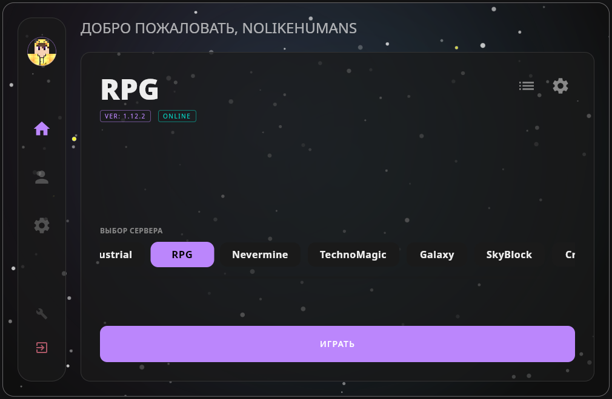
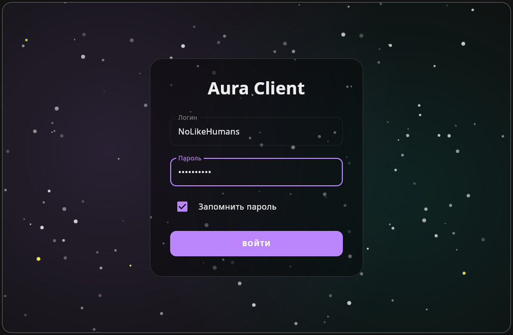
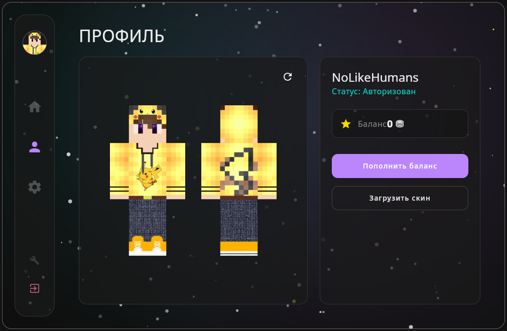
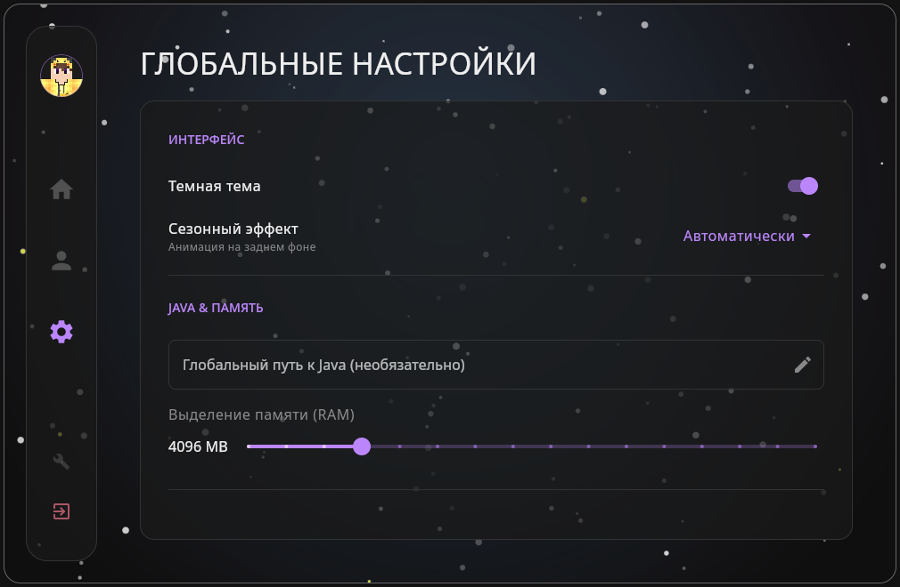
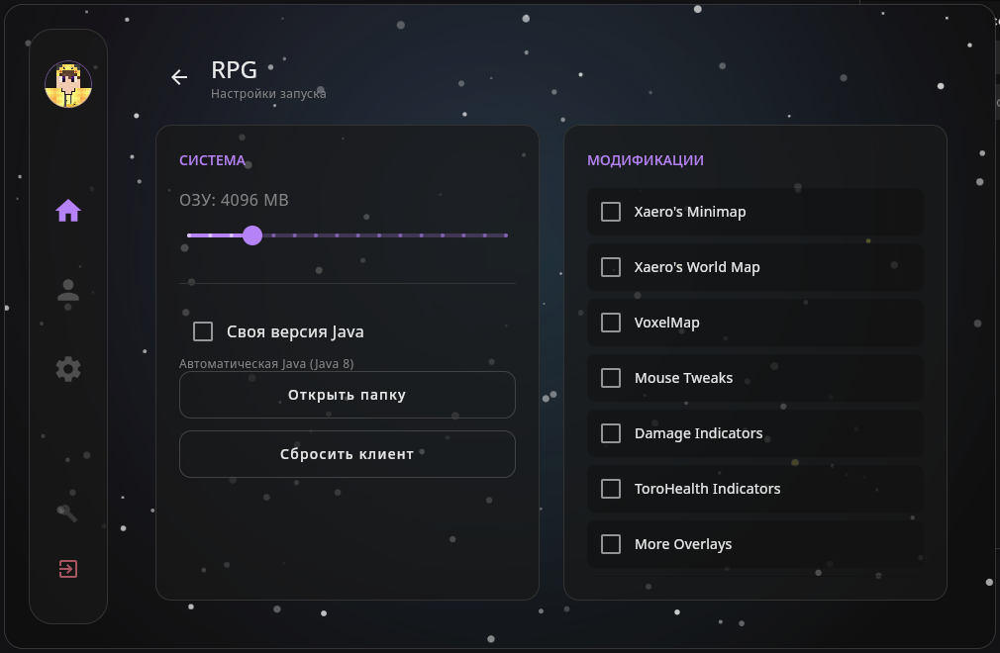

# Aura Launcher (Unofficial)

<div align="center">


<br>

[ 🇬🇧 English ](README.md) | [ 🇷🇺 Русский ](README_RU.md) | **[ 🇩🇪 Deutsch ]**

</div>

> **Ein inoffizieller** Launcher für das [SmartyCraft](https://smartycraft.ru) Projekt.
> Entwickelt als leichte, schnelle und offene Alternative zum offiziellen Client.

**Aura Launcher** ist mehr als nur ein "Spielen"-Button. Es ist ein modernes Zuhause für dein Spiel, von Grund auf in **Kotlin** mit **Compose Multiplatform** geschrieben.

Wir glauben, dass sich das Starten deines Lieblingsservers nicht anfühlen sollte wie die Interaktion mit einem Relikt aus 2013. Im Gegensatz zum Original-Client schleppt Aura keine uralten Java-Versionen mit sich herum, startet sofort und respektiert dein Betriebssystem — egal ob Linux, Windows oder macOS.

<p align="center">
  
</p>

## ✨ Warum Aura?

Wir haben Aura gebaut, weil wir effiziente Software lieben.

* **Durchatmen:** kein Ballast. Die Oberfläche wird von **Compose Desktop** angetrieben, was sie reaktionsschnell und ressourcenschonend macht.
* **Atmosphärisch:** Der Launcher lebt mit dir. Er bietet dynamische **saisonale Themen** — vom sanften winterlichen Schneefall bis zu sommerlichen Glühwürmchen — die sich automatisch an die Jahreszeit (oder deine Stimmung) anpassen.
* **Linux First:** Wir behandeln Linux-Nutzer nicht als Bürger zweiter Klasse. Aura bietet ein natives Erlebnis: AppImage-Support, nahtlose Wayland-Integration und kein "Gefrickel", um Java zum Laufen zu bringen.
* **Transparent & Offen:** Du verdienst es zu wissen, was auf deinem Rechner läuft. Unser Code ist zu 100% Open Source unter der GPLv3-Lizenz.

## 🎨 Galerie

### Login & Profil
|                          Account Login                           |                      Spielerprofil                       |
|:----------------------------------------------------------------:|:--------------------------------------------------------:|
|  |  |

### Einstellungen & Anpassung
|                             Globale Einstellungen                              |                             Client-Konfiguration                             |
|:------------------------------------------------------------------------------:|:----------------------------------------------------------------------------:|
|  |  |

---

## 📚 Dokumentation

Für Entwickler, Mitwirkende und Neugierige.
Wir pflegen eine detaillierte technische Dokumentation, die die Architektur, die saisonale Engine und den Netzwerk-Stack abdeckt.

👉 **[Entwickler-Wiki öffnen](docs/de/index.md)**

---

## 🚀 Installation

Hol dir die neueste Version von unserer **[Releases](https://github.com/Kitty-Hivens/Aura-Launcher/releases)** Seite.

### 🐧 Linux
Wir legen Wert auf deine Erfahrung.
* **AppImage:** Der Universalschlüssel. Einfach herunterladen, ausführbar machen (`chmod +x AuraLauncher.AppImage`) und starten.
* **Native Pakete:** `.deb` (Debian/Ubuntu/Mint) und `.rpm` (Fedora/RedHat/OpenSUSE) für eine nahtlose Systemintegration sind ebenfalls verfügbar.

### 🪟 Windows
* Lade den `.msi` Installer herunter und führe ihn aus.
* Aura kümmert sich automatisch um die Java-Umgebung für das Spiel. Keine manuelle Konfiguration nötig.

### 🍎 macOS
* Lade das `.dmg` Image herunter.
* Ziehe die Anwendung in deinen `Applications`-Ordner.
* *Unterstützt sowohl Intel als auch Apple Silicon.*

## 🛠️ Aus dem Quellcode bauen

Für diejenigen, die gerne basteln.
Du benötigst **JDK 21** oder höher.

1.  **Repository klonen:**
    ```bash
    git clone https://github.com/Kitty-Hivens/Aura-Launcher.git
    cd Aura-Launcher
    ```

2.  **Distribution bauen:**
    * **Linux / macOS:**
        ```bash
        ./gradlew :client-ui:packageDistribution
        ```
    * **Windows:**
        ```bash
        gradlew.bat :client-ui:packageDistribution
        ```

3.  **Artefakte finden:**
    Dein frischer Build wartet hier auf dich:
    `client-ui/build/compose/binaries/main/`

## ⚖️ Haftungsausschluss

Dieses Projekt ist **inoffizielle Software**.
Der Entwickler des Auralaunchers steht in keiner Verbindung zur Administration von SmartyCraft.
Alle Rechte an Serverinhalten, Mods und Marken liegen bei ihren jeweiligen rechtmäßigen Eigentümern.

## 📄 Lizenz

Dieses Projekt wird unter der **GNU GPL v3** Lizenz vertrieben.
Dies garantiert, dass Aura (und jegliche Modifikationen daran) immer frei und Open Source bleiben.

---

<div align="center">
  <i>Mit 💜 und Kotlin erstellt von <a href="https://github.com/Kitty-Hivens">Kitty-Hivens</a></i>
</div>
